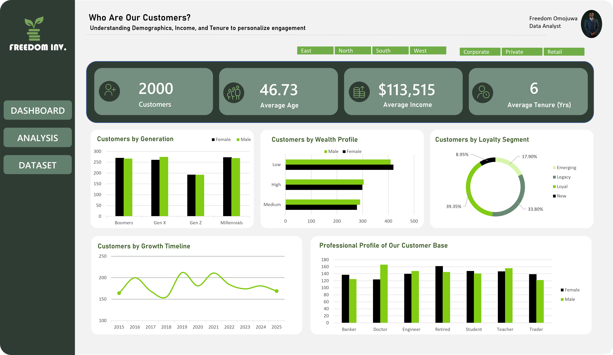

# Customer Segmentation & Demographic Analysis Dashboard (Excel)
> *Interactive Excel dashboard designed to analyze customer demographics, income levels, loyalty segments, occupations, and customer growth patterns to support customer-focused business decisions.*


---

## Table of Contents

1. [Project Overview](#1-project-overview)
2. [Objectives](#2-objectives)
3. [Project Scope & Tools](#3-project-scope--tools)
4. [Repository Structure](#4-repository-structure)
5. [Data Workflow](#5-data-workflow)
6. [Data Model & Schema](#6-data-model--schema)
7. [Analysis & Metrics](#7-analysis--metrics)
8. [Key Insights](#8-key-insights)
9. [Recommendations](#9-recommendations)
10. [Assumptions & Limitations](#10-assumptions--limitations)
11. [Future Enhancements](#11-future-enhancements)
12. [Deliverables](#12-deliverables)
13. [Author](#13-author)

---

## 1. Project Overview

**Context:** 
This project focuses on analyzing customer data to better understand segmentation patterns, demographic distribution, income levels, loyalty, and growth trends.

**Problem Statement:** 
Businesses often struggle to understand the diverse needs of different customer groups, making it challenging to personalize marketing strategies and enhance customer retention.

**Approach:**  
Using Excel, Power Query, Pivot Tables, and Pivot Charts, raw customer data was cleaned, transformed, and analyzed to build an interactive dashboard.

**Outcome:**
A dynamic customer segmentation dashboard that provides insights into demographics, income distribution, loyalty behavior, occupation patterns, and customer growth trends.

---

## 2. Objectives

- **Primary Objective:** Build an interactive dashboard for customer segmentation analysis
- **Secondary Objectives:**
-Identify customer distribution by generation
- Analyze income and wealth profiles
- Evaluate customer loyalty and tenure groups
- Understand occupational distribution
- Track customer growth over time

> 💡 *Every analysis and dashboard component in this project was designed to support these objectives.*

---

## 3. Project Scope & Tools

### Scope

-->
| Category | Tools |
|----------|------|
| Data Processing | Excel, Power Query |
| Analysis | Pivot Tables, Pivot Charts |
| Visualization | Excel Dashboard |
| Interaction | Slicers |
| Documentation | GitHub README |

---

## 4. Repository Structure

```
furniture-sales-performance-dashboard/
│
├── data/
│   ├── raw/          # Original dataset before cleaning
│   └── processed/    # Cleaned and transformed data used for analysis and dashboard 
│
├── visuals/          # Dashboard screenshots and exported visuals 
│
└── README.md         # You are here (Project documentation)
```

---

## 5. Data Workflow

```
Raw customer data
      ↓
Data Import into Excel
      ↓
Data Cleaning & Transformation (Power Query)
      ↓
Pivot Table & Pivot Chart Analysis
      ↓
Interactive Dashboard Development
      ↓
Business Insights & Reporting
```

---

## 6. Data Model & Schema

## Dataset: Furniture Sales Data

This dataset contains transactional-level furniture sales records used for analysis and dashboard development.

Each row represents a single sales transaction, including customer, product, shipping, and financial details.

---

## Data Structure

| Field Name        | Data Type | Description                          | Example Value |
|------------------|----------|--------------------------------------|---------------|
| CustomerID       | Text     | Unique customer ID                   | CUST-1001     |
| Name             | Text     | Customer full name                   | Emily Davis   |
| Gender           | Text     | Customer gender (Male/Female)       | Male          |
| Age              | Number   | Age of the customer                  | 29            |
| Generation       | Text     | Customer generation group            | Millennial    |
| Region           | Text     | Customer location region             | East          |
| Occupation       | Text     | Customer job role                    | Engineer      |
| Income           | Number   | Annual income of customer            | 250000       |
| Income Bracket   | Text     | Income category                      | Medium        |
| Customer Segment | Text     | Type of customer segment             | Retail        |
| Join_Date        | Date     | Customer registration date           | 2021-06-15    |
| Tenure           | Number   | Years as a customer                  | 3             |
| Tenure Group     | Text     | Customer loyalty category            | Loyal         |
| Year             | Number   | Year the customer joined             | 2021          |   

> **Row count (approx.):** 2001 rows
> **Date range:** 01/02/2015 – 12/30/2025

---

## 7. Analysis & Metrics

### Analytical Approach

This project uses exploratory data analysis (EDA) in Excel to examine furniture sales performance across regions, customer segments, product categories, and shipping methods. The goal is to identify trends, performance drivers, and business opportunities from transactional sales data.

The analysis was carried out using Pivot Tables, Pivot Charts, and Excel formulas to summarize and visualize key business metrics.


## Key Metrics Defined

| Metric | Definition | Why It Matters |
|--------|------------|----------------|
| Total Sales | Total revenue generated from all furniture transactions | Measures overall business sales performance |
| Total Profit | Total profit earned after discounts and sales | Measures profitability performance |
| Total Quantity | Total number of products sold | Measures sales volume and customer demand |
| YoY Growth | Percentage increase or decrease compared to the previous year | Tracks yearly business performance changes |
| Shipping Duration | Number of days between order date and ship date | Evaluates delivery performance and shipping efficiency |

---
## Methods Used

- Data cleaning and transformation using Power Query
- KPI calculations for Sales, Profit, and Quantity
- Pivot Tables for summarization and aggregation
- Pivot Charts for monthly sales trend analysis
- Geographic sales analysis using Excel Map visuals
- Shipping mode and shipping duration analysis
- Interactive filtering using Region and Segment slicers
- Category and city-level sales comparison 

---


## 8. Key Insights

### Insight 1: California Recorded the Highest Sales Performance

The dashboard shows that California generated the highest sales contribution among all states, indicating stronger customer demand and higher transaction activity compared to other regions.

### Insight 2: Chairs Were the Best-Performing Furniture Category

Among all furniture sub-categories, Chairs generated the highest sales revenue, making it the strongest-performing product category in the dataset.

### Insight 3: Standard Class Was the Most Frequently Used Shipping Method

Most customer orders were shipped using Standard Class delivery, suggesting a preference for more cost-effective shipping options over faster premium methods.

### Insight 4: Most Orders Were Delivered Within 4–5 Days

Shipping duration analysis revealed that the majority of orders were delivered within 4 to 5 days, showing relatively stable delivery performance across transactions.

### Insight 5: Sales Increased Significantly Toward Year-End

Monthly sales trends show stronger sales performance during November and December, suggesting possible seasonal demand increases during the end of the year.

### Insight 6: Consumer Customers Contributed the Largest Share of Sales

The Consumer segment generated the highest overall sales contribution compared to Corporate and Home Office segments, showing that individual customers drove most of the revenue.

---

## 9. Recommendations

| Priority | Recommendation | Based On | Suggested Owner |
|----------|---------------|----------|-----------------|
| High | Increase inventory availability and marketing activities in top-performing states such as California to maximize revenue opportunities | Insight 1 | Sales & Inventory Team |
| High | Focus promotional campaigns on high-performing categories like Chairs to drive additional sales growth | Insight 2 | Marketing Team |
| Medium | Maintain and optimize Standard Class shipping operations since it is the most preferred shipping method among customers | Insight 3 | Operations Team |
| Medium | Prepare targeted promotional campaigns before peak sales periods such as November and December | Insight 5 | Marketing & Sales Team |
| Low | Develop strategies to improve engagement and sales contribution from Corporate and Home Office customer segments | Insight 6 | Business Development Team |
---

## 10. Assumptions & Limitations

### Assumptions

- All transaction records in the dataset were assumed to be complete and accurate.
- Sales, profit, and discount values were assumed to be correctly recorded.
- Shipping duration values were assumed to reflect actual delivery timelines.
- Customer and regional information were assumed to be consistent across all records.

---

### Limitations

- The dataset is a sample/tutorial dataset and may not fully represent real-world business operations.
- The analysis focuses only on historical sales data and does not include predictive forecasting.
- Customer demographic and behavioral data were not included in the dataset.
- External business factors such as marketing spend, economic conditions, and competitor activity were not considered.
- The project was developed entirely in Excel without advanced statistical or machine learning analysis.

---

## 11. Future Enhancements

- [ ] Build a Power BI version of the dashboard for enhanced interactivity
- [ ] Add automated dashboard refresh using Power Query connections
- [ ] Include predictive sales forecasting analysis
- [ ] Expand the dashboard with additional KPIs and customer behavior analysis

---

## 12. Deliverables

| Deliverable | Description | Location |
|-------------|-------------|----------|
| Raw Dataset | Original furniture sales dataset used for analysis | `/data/raw/` |
| Processed Dataset | Cleaned and transformed dataset used for dashboard reporting including Interactive Excel dashboard with KPIs, slicers, charts, and maps | `/data/processed/` |
| Dashboard Visuals | Dashboard screenshots and exported visuals | `/visuals/` |
| README Documentation | Full project documentation and workflow explanation | `/README.md` |

---

## 13. Author

**Freedom Omojuwa**
Aspiring Data Analyst | Quantity Surveying Graduate

- 🔗 linkedin.com/in/freedom-omojuwa-1a64b8249
- 💼 freedom-omojuwa.github.io
- 📧 Freedomomojuwa@gmail.com

---

*Last updated: May 2026*

